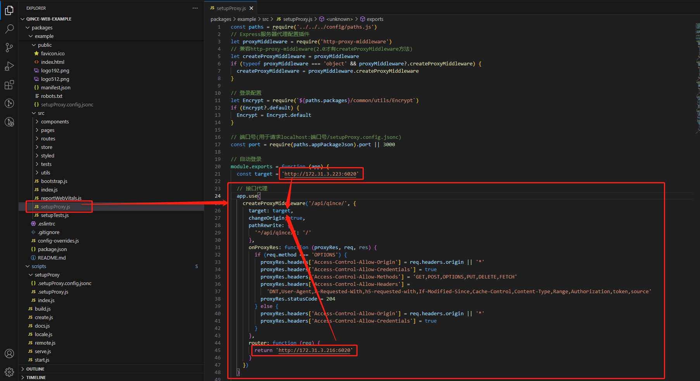
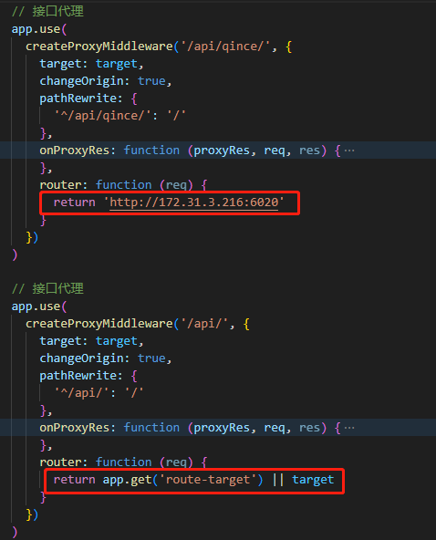

### 代理配置位置

> **引入：**
>
> devServer中Express进行请求中间拦截。
>
> 在默认情况下代理目标是target。但是可以通过router覆写target。
>
> **原理：**
>
> 在启动脚本中没有显式调用 ```setupProxy.js``` ，也没有显式调用 ```setupProxy.config.jsonc``` 。根据运行结果推断是在创建webpack-dev-server时第三方库引用并执行了这些文件。并且将 ```setupProxy.config.jsonc``` 中的内容覆写到 ```setupProxy.js``` 中配置的代理中。
>
> 
>
> **多个反向代理配置：**
>
> 默认情况下所有接口都添加了 ```/api``` 前缀方便统一进行反向代理，但是一个服务端程序不一定运行了所有接口，可能需要代理到其它服务端。例如 ```/api/qince/``` 的配置，指定了有目标程序的服务器。但是请注意前提，服务端需要支持单点登录，否则不好进行身份验证。
>
> 

