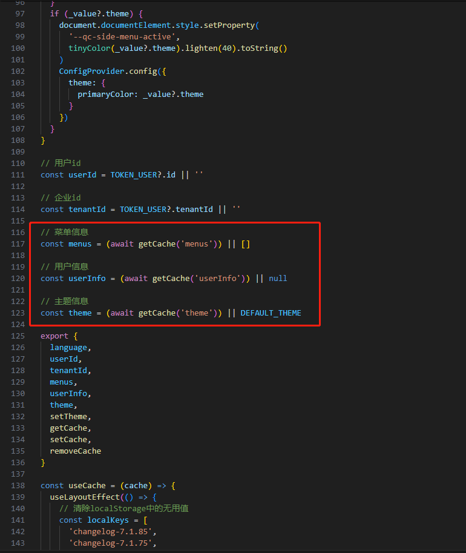
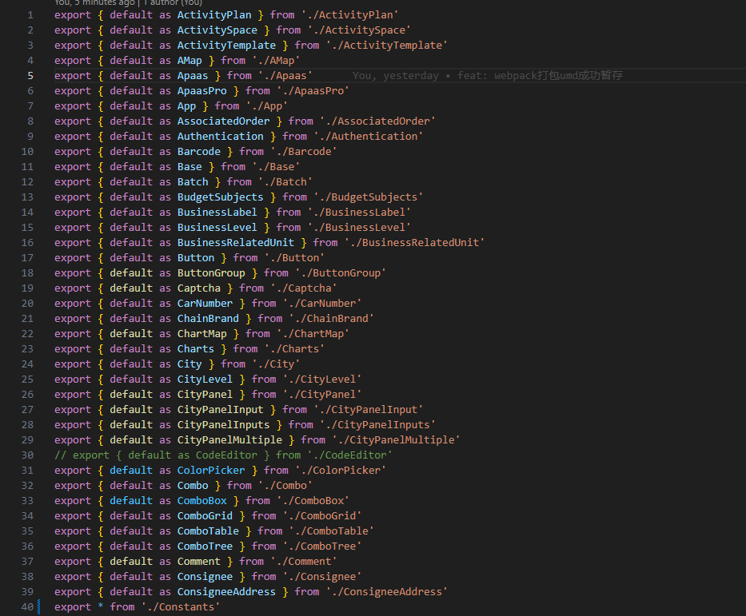
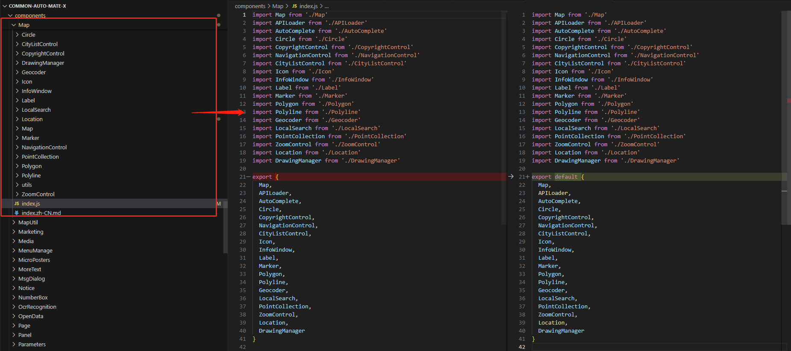
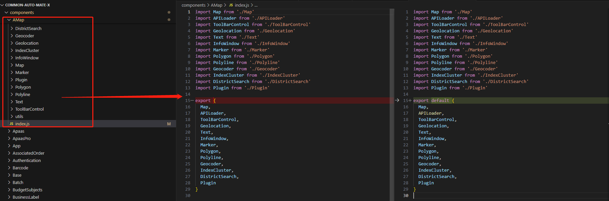
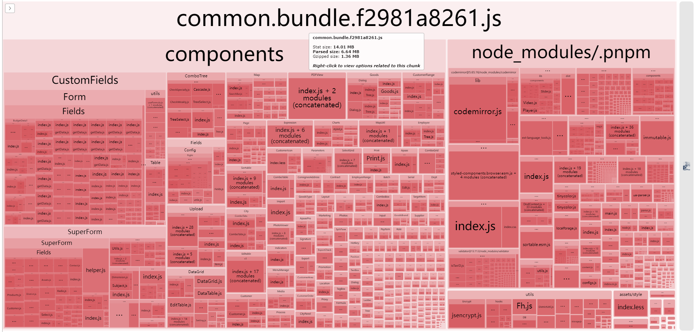
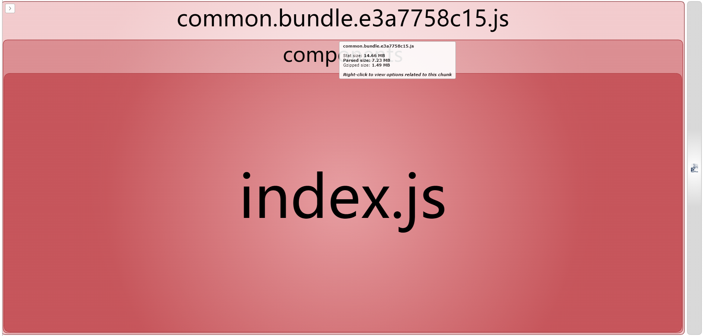
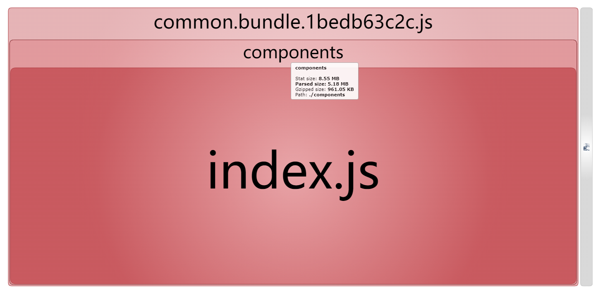

### <font color=green>**1.打包背景介绍**</font>

> <font color=green>**与定制业务解耦：** </font>
>
> * **UMD包解耦：** 定制业务需要使用标准产品的公共控件，定制业务发布包时会携带标准产品项目和公共控件，需要标准产品相关开发人员值守。为了解耦这种关系，把公共控件和需要的标准产品模块打包成UMD给定制开发者使用。这样定制产品在发布时不会携带非定制代码，标准产品和公共控件的迭代通过发布UMD包实现。
> * **MonoRepo权限控制：** 得物前端使用大仓库MonoRepo管理所有子项目，并且投入大量资金做精确且复杂的大仓库权限控制。在一定程度上这种做法可以确保定制业务难以影响到标准产品。但是考虑到目前项目已经拆解为git submodule，因此暂时不采用这种做法。
>
> <font color=green>**提升业务项目打包速度：** </font>
>
> * **不打包部分模块：** 把项目里部分模块抽出去不打包可以节约打包时间。考虑将某些内部的公共控件库打包成UMD包，单独迭代。这样每次项目发布可以减少一定打包压力。另外考虑采用DLLPlugin的方式，将某些几乎不迭代的第三方依赖作为“动态链接库”的形式放到代理服务器上。本次只记录下UMD打包的过程。
> * **RSpack：** 考虑使用字节跳动新推出的RSpack优化项目打包速度，但是项目打包配置内容过多，迁移时产生了很多问题，陷入僵局，暂时不考虑这种做法。并且RSpack的优化主要集中于生产环境与热更新，因此考虑在后续的新产品项目中使用RSpack。


### <font color=green>2.外部依赖配置</font>

> <font color=green>**添加必须外部依赖：**</font>
>
> > <font color=green>**组件库配置：**</font>
> >
> > react和react-dom是组件库common项目必须添加的外部依赖，否则打包后的组件库无法正常使用
> >
> > **原因分析：**
> > $$
> > \because \ \ \ react-dom在渲染根组件时会挂载useState，memo等钩子 \\
> > \therefore \ \ \ 如果不挂载根组件，使用useState等钩子无效  \\ 
> > \Rightarrow \\
> > \because \ \ \ 组件库不存在html入口，不会触发react-dom挂载react钩子 \\
> > \therefore \ \ \ 两者如果不作为外部依赖直接打入umd包会导致react一系列钩子都无法使用
> > $$
> > **配置操作：**
> >
> > * 组件库打包时react和react-dom作为外部依赖
> >
> >   ```javascript
> >   module.exports = {
> >       externals: [
> >           nodeExternals({
> >             importType: (moduleName) => {
> >               switch (moduleName) {
> >                 case 'react':
> >                   return 'React'
> >                 case 'react-dom':
> >                   return 'ReactDOM'
> >                 default:
> >                   return
> >               }
> >             }
> >           })
> >     	]
> >   }
> >   ```
> >
> > <font color=green>**业务端配置：**</font>
> >
> > react和react-dom也是业务git submodule或monorepo中项目必须添加的外部依赖，否则打包后的组件库无法正常使用。
> >
> > **原因分析：**
> > $$
> > \because \ \ \ 查看打包后代码：umd模块中是通过require来引入外部依赖的。 \\
> > \because \ \ \ 业务代码引用umd模块的组件库是放到入口html挂载到window上使用。 \\
> > \therefore \ \ \ umd组件库中require的外部依赖也应该在window上。 \\ 
> > \Rightarrow \\
> > \therefore \ \ \ 要在业务入口html通过umd模块引入react和react-dom \\ \\
> > 
> > \because \ \ \ 组件库中需要使用react钩子 \\
> > \therefore \ \ \ 通过umd模块引入的react和react-dom必须渲染根组件，这样才能react-dom挂载钩子 \\
> > \Rightarrow \\
> > \therefore \ \ \ 要将react和react-dom作为业务端的外部依赖
> > $$
> > **配置操作：**
> >
> > * 业务入口html引入react和react-dom
> >
> >   ```html
> >     <script crossorigin src="https://unpkg.com/react@18/umd/react.development.js"></script>
> >     <script crossorigin src="https://unpkg.com/react-dom@18/umd/react-dom.development.js"></script>
> >   ```
> >
> > * 业务打包时react和react-dom作为外部依赖
> >
> >   ```javascript
> >   module.exports = {
> >       externals: {
> >           react: 'React',
> >       	'react-dom': 'ReactDOM',
> >       }
> >   }
> >   ```
>
> <font color=green>**添加体积较大的包到外部依赖：**</font>
>
> > <font color=green>**添加原则：**</font>
> >
> > 项目没有使用SSR，即使有http缓存策略和PWA缓存策略，但是为了保证首次无缓存的加载速度，在首页需要加载的库尽量不放到外部依赖。
> >
> > ```javascript
> > // 组件库打包中添加的体积较大的外部依赖
> > module.exports = {
> >     externals: [
> >         nodeExternals({
> >           importType: (moduleName) => {
> >             switch (moduleName) {
> >               case 'react':
> >                 return 'React'
> >               case 'react-dom':
> >                 return 'ReactDOM'
> >               case 'react-dom/server':
> >                 return 'ReactDOMServer'
> >               case 'exceljs':
> >                 return 'ExcelJS'
> >               case 'mathjs':
> >                 return 'math'
> >               case 'antd':
> >                 return 'antd'
> >               default:
> >                 return
> >             }
> >           }
> >         })
> >   	],
> > }
> > ```
> >
> > <font color=green>**解决副作用**</font>
> >
> > 组件库打包时让antd作为了外部依赖。项目使用的是antd4.x，在组件库未单独打umd包前还需要引入样式文件，在打包时还配置了插件将antd依赖的momentjs转为体积较小的dayjs。但是antd作为外部依赖后应该在入口引入样式文件，也不需要配置转dayjs的插件。
> >
> > * 业务端入口html单独引入antd的样式css或less
> > * webpack不需要配置antd中momentjs转dayjs插件
> > * 注意umd形式引入antd的依赖关系，需要先引入react，react-dom，moment


### <font color=green>3.异步模块配置</font>

> <font color=green>**顶层await使用：**</font>
>
> 在7.2.15分支的utils/hooks/useCache.js中在模块顶层使用await获取了一些配置信息，例如主题，用户，菜单信息等。由于webpack5已经支持了顶层await，因此在development和production环境下打包部署都没有出现错误。
>
> 
>
> <font color=green>**导致的副作用：**</font>
>
> 只要是引用了该钩子的控件都受到了顶层await的影响，由于Request.js中引入了该钩子，因此几乎所有控件都受到了影响。打包输出的umd模块会被默认转为promise对象挂载到window上，以此来保证在模块内顶层await的返回值可以立即使用。因此在使用umd模块替换原来的git submodule组件库时就必须修正引用方式。
>
> ```javascript
> // 组件库以git子模块集成在某个业务项目中
> import { Import } from 'components'
> 
> // 使用umd引入形式代替git子模块形式的组件库
> const { Import } = await import('components')
> ```
>
> <font color=green>**解决方案：**</font>
>
> 为了保持第一种import引入形式，尝试了两种解决方案，第二种较为合适。
>
> * 调整顶层await的写法，改成返回promise（可能导致改动位置太多，项目已经有很多位置引入该钩子）
>
> * 调整外部依赖引入，组件库被当作promise外部依赖。
>
>   ```javascript
>   // 业务项目中的webpack config-override配置
>   module.exports = {
>       // ...省略无关配置
>       config.externals = {
>           ...config?.externals,
>           react: 'React',
>           'react-dom': 'ReactDOM',
>           moment: 'moment',
>           antd: 'antd',
>           // 调整components为promise外部依赖
>           components: 'promise components'
>       }
>   	return config
>   }
>   ```


### <font color=green>4.命名方式配置</font>

> <font color=green>**打包入口文件说明：**</font>
>
> 在配置时出现了一些命名冲突问题，在这里举一个例子。
>
> > * 打包时在common组件库打包入口类似于antd的es包引入了所有组件并重新导出。
> >
> >   
> >
> > * 由于部分控件没有提供 ```export default``` 导出内容，只提供 ```export {}``` 导出内容。因此打包入口文件目前的重新导入导出规则是每个common中的文件夹作为一个默认导出模块，里面的所有组件到挂载到默认模块上。
> >
> >   * 百度地图：
> >
> >     
> >
> >   * 高德地图：
> >
> >     
>
> <font color=green>**问题说明与解决：**</font>
>
> > 如果提升百度地图和高德地图下所有的模块到打包入口文件，会造成命名冲突。下面百度地图控件和高德地图控件的子模块有很多重名情况。最后考虑暂时将百度地图和高德地图的导出转为 ```export default``` 。有这种命名碰撞的问题的地方很多在超级表单控件中也存在。
> >
> > ```javascript
> > // 百度地图react控件导出内容
> > export {
> >   Map,
> >   APILoader,
> >   AutoComplete,
> >   Circle,
> >   CopyrightControl,
> >   NavigationControl,
> >   CityListControl,
> >   Icon,
> >   InfoWindow,
> >   Label,
> >   Marker,
> >   Polygon,
> >   Polyline,
> >   Geocoder,
> >   LocalSearch,
> >   PointCollection,
> >   ZoomControl,
> >   Location,
> >   DrawingManager
> > }
> > 
> > // 高德地图react控件导出内容
> > export {
> >   Map,
> >   APILoader,
> >   ToolBarControl,
> >   Geolocation,
> >   Text,
> >   InfoWindow,
> >   Marker,
> >   Polygon,
> >   Polyline,
> >   Geocoder,
> >   IndexCluster,
> >   DistrictSearch,
> >   Plugin
> > }
> > ```


### <font color=green>5.打包体积分析</font>

> <font color=green>**问题描述：**</font>
>
> 不输出umd包且是development环境的情况下包大小分析如下：
>
> <font color=red>**注意：后续需要考察下CustomFields和SuperForm中的具体控件为什么占用空间这么大，例如Employee引用的就是组件库中的Employee，但是大小在开发模式下仍然占到5KB左右。**</font>
>
> 
>
> 在上面几个问题的解决中已经把一些体积较大的包放入外部依赖，但是打包成umd后进行体积分析，发现体积很大，最后的umd包的体积是1.49MB左右。
>
> 
>
> 修改打包配置，所有的node_modules都作为外部依赖。最后的umd包的体积是960KB左右，我们的目标是1.2MB左右，说明仍然可以借助提取第三方包作为外部依赖来压缩umd包的体积。
>
> 


### <font color=green>6.完整配置</font>

> <font color=green>**组件库配置：**</font>
>
> ```javascript
> const path = require('path')
> 
> const webpack = require('webpack')
> const { CleanWebpackPlugin } = require('clean-webpack-plugin')
> const BundleAnalyzerPlugin = require('webpack-bundle-analyzer').BundleAnalyzerPlugin
> const WebpackBar = require('webpackbar')
> const nodeExternals = require('webpack-node-externals')
> 
> module.exports = {
>   entry: path.resolve(__dirname, './components/index.js'),
>   output: {
>     path: path.resolve(__dirname, 'dist'),
>     filename: 'common.bundle.[hash:10].js',
>     library: {
>       name: 'components',
>       type: 'umd'
>     }
>   },
>   module: {
>     rules: [
>       {
>         oneOf: [
>           {
>             test: /\.css$/,
>             use: ['style-loader', 'css-loader']
>           },
>           {
>             test: /\.less$/,
>             use: [
>               'style-loader',
>               'css-loader',
>               {
>                 loader: 'less-loader',
>                 options: {
>                   lessOptions: {
>                     // less中允许使用脚本
>                     javascriptEnabled: true
>                   }
>                 }
>               }
>             ]
>           },
>           {
>             test: /\.js$/,
>             exclude: /node_modules/,
>             use: {
>               loader: 'babel-loader',
>               options: {
>                 presets: ['@babel/preset-env', '@babel/preset-react']
>               }
>             }
>           }
>         ]
>       }
>     ]
>   },
>   plugins: [
>     // 清理上次打包结果
>     new CleanWebpackPlugin(),
>     // 体积分析
>     new BundleAnalyzerPlugin(),
>     // 进度分析
>     new WebpackBar({
>       // 默认true，启用一个简单的日志报告器
>       basic: false
>     }),
>     // 打包后文件中使用的全局变量
>     new webpack.DefinePlugin({
>       'process.env': Object.entries(process.env).reduce(
>         (target, [key, value]) => {
>           // 只支持双引号字符串，如果使用单引号字符串会直接把值暴露出去（例如：{ path: './xxx' }被转换成{ path: ./xxx }）
>           target[key] = JSON.stringify(value)
>           return target
>         },
>         { NODE_ENV: JSON.stringify('production') }
>       )
>     })
>   ],
>   optimization: {
>     // 产生错误也输出包（便于排查错误）
>     noEmitOnErrors: false
>   },
>   resolve: {
>     alias: {
>       components: path.resolve(__dirname, './components'),
>       utils: path.resolve(__dirname, './utils'),
>       locale: path.resolve(__dirname, './locale'),
>       assets: path.resolve(__dirname, './assets')
>     }
>   },
>   externalsType: 'umd',
>   externals: [
>     // 遍历所有第三方包
>     nodeExternals({
>       importType: (moduleName) => {
>         // 打包组件库时react和react-dom必须作为外部依赖：
>         // （1）react-dom在渲染根组件时会挂载useState，memo等钩子。如果不挂载根组件，使用useState等钩子无效。
>         // （2）两者如果不作为外部依赖直接打入umd包会导致react一系列钩子都无法使用，因为组件库不存在入口页面，不会挂载根组件。
>         switch (moduleName) {
>           case 'react':
>             return 'React'
>           case 'react-dom':
>             return 'ReactDOM'
>           case 'react-dom/server':
>             return 'ReactDOMServer'
>           case 'exceljs':
>             return 'ExcelJS'
>           case 'mathjs':
>             return 'math'
>           case 'antd':
>             return 'antd'
>           case '@ant-design/plots':
>             return 'Plots'
>           case 'lodash':
>             return '_'
>           case 'i18next':
>             return 'i18next'
>           case 'react-ace':
>             return 'ReactAce'
>           default:
>             return
>         }
>       }
>     })
>   ],
>   mode: 'production'
> }
> ```
>
> <font color=green>**业务项目配置：**</font>
>
> 业务代码的webpack过于庞大，引用了很多其它文件，无法直接展示。下面列出webpack总配置文件中暴露给业务的覆写配置。
>
> ```javascript
> module.exports = function override(config, env) {
>   config.externals = {
>     ...config?.externals,
>     react: 'React',
>     'react-dom': 'ReactDOM',
>     moment: 'moment',
>     antd: 'antd',
>     lodash: '_',
>     i18next: 'i18next',
>     '@ant-design/plots': 'Plots',
>     components: 'promise components'
>   }
>     
>   // 测试业务代码，不启用code split
>   config.optimization.splitChunks = {}
> 
>   return config
> }
> 
> ```