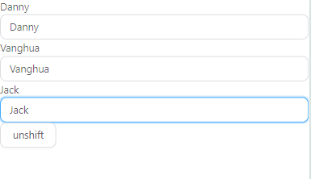
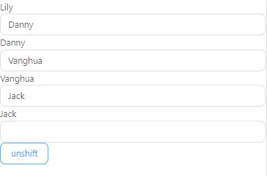
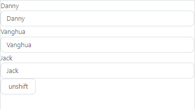
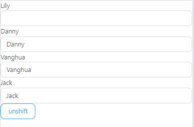

### 1.key

#### 1.1 key在diff算法中的表现

> **diff算法回顾：**
>
> 回顾一下虚拟DOM中的diff算法：
>
> * 在同级节点中根据key寻找新旧节点。
>
> * 如果找到新旧节点，则根据不同框架的比较算法判断是否需要更新或复用节点。
> * 如果没有找到匹配的新旧节点，则根据新增或删除的情况来新增或删除节点。
>
> **key不可变：**
>
> <font color=red>**注意： 关键点在于根据key寻找新旧节点，然后对比新旧节点的变化。因此在虚拟DOM变化时，每个节点对应的key应该是不可变的。如果节点对应的key值改变，那么会导致对比新旧节点时可能对比的不是同一个真实DOM对应的虚拟DOM节点。**</font>


#### 1.2 key可变化的影响

> **key不可变：**
>
> 新旧虚拟DOM中，同一个真实DOM对应的虚拟DOM节点DOM的key变化，可能导致难以理解的情景。
>
> **key可变的影响：**
>
> 在不手动更新虚拟DOM上的状态，只是破坏key的不可变化特性时，可能导致以下后果：
>
> * 如果key变化为一个从未存在的新值，那么会导致重新渲染，不会造成状态混乱。
>
> * 如果key变化为一个其它虚拟DOM上的key的值，那么会导致两者状态同步。
>
> * 如果key恰好和另一个虚拟DOM的key产生了交换，那么会导致两者状态互换。
>
> **key可变举例：**
>
> 下面是在列表头部插入元素导致key变化的例子。在列表中删除元素，交换元素的顺序也有一样的效果。
>
> ```react
> import { useState, Fragment } from 'react'
> import { Button, Input } from 'antd'
> 
> export default () => {
>   const [textValue, setTextValue] = useState(['Danny', 'Vanghua', 'Jack'])
> 
>   const generator = () =>
>     Array.from({ length: textValue.length }).map((_, index) => (
>       <div key={index}>
>         {textValue[index]}
>         <Input key={index} />
>       </div>
>     ))
> 
>   return (
>     <Fragment>
>       {generator()}
>       <Button onClick={() => setTextValue(['Lily', ...textValue])}>{'unshift'}</Button>
>     </Fragment>
>   )
> }
> ```
>
> 
>
> 点击unshift按钮，在列表头部插入一个新元素。列表中的四个虚拟DOM的key值全部发生了变化，我们也没有控制虚拟DOM节点状态的刷新，因此节点状态被复用。
>
> 


#### 1.3 消除key可变的影响

> 在key变化时也更新对应列表的状态，这样key的变化就不重要，列表元素一定刷新。这样虽然消除了key可变的影响，但是不建议使用，建议保证key的不可变性。
>
> ```react
> import { useState, Fragment } from 'react'
> import { Button, Input } from 'antd'
> import { produce } from 'immer'
> 
> export default () => {
> const [textValue, setTextValue] = useState([
>  { text: 'Danny', input: '' },
>  { text: 'Vanghua', input: '' },
>  { text: 'Jack', input: '' }
> ])
> 
> const generator = () =>
>  Array.from({ length: textValue.length }).map((_, index) => (
>    <div key={index}>
>      {textValue?.[index]?.text}
>      <Input
>        key={index}
>        value={textValue?.[index]?.input}
>        onChange={(e) =>
>          setTextValue(
>            produce((textValue) => {
>              textValue[index].input = e?.target?.value
>            })
>          )
>        }
>      />
>    </div>
>  ))
> 
> return (
>  <Fragment>
>    {generator()}
>    <Button onClick={() => setTextValue([{ text: 'Lily', input: '' }, ...textValue])}>
>      {'unshift'}
>    </Button>
>  </Fragment>
> )
> }
> ```
>
> 
>
> 点击unshift在列表前再插入一个元素
>
> 