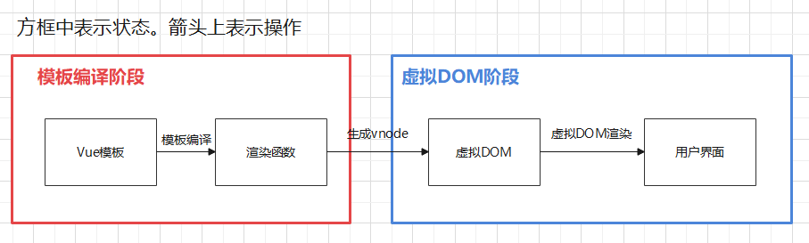
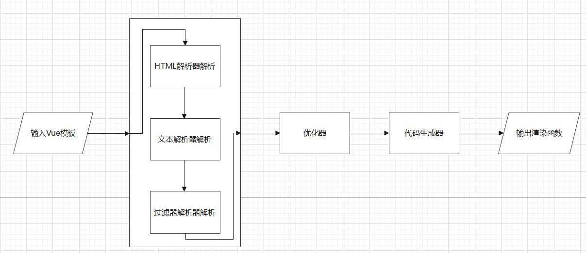
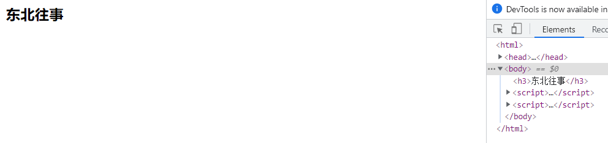

# 1.模板编译流程

### 1.1 模板编译在整个渲染过程中的位置



### 1.2 模板编译的流程



#### 1.2.1 解析器：

**HTML解析器：** 解析HTML代码。明确标签的父子节点（使用栈来维护父子节点关系，详细介绍可以参考另一篇博客“浏览器渲染”），明确有哪些标签，明确标签有哪些属性等等。

**文本解析器：** 普通文本并不需要解析，这是用来解析模板中动态绑定的数据。

**过滤器解析器：** 解析Vue使用的过滤器。

**解析器的输出：** 解析器输出抽象语法树AST来描述节点信息和父子节点关系（关于AST的介绍可以参考另一篇博客“解释器和编译器”）


#### 1.2.2 优化器： 

**优化器的输出：** 优化器输出优化后的抽象语法树AST。优化器给AST中的静态节点打上标记，在新旧虚拟DOM对比时，具有静态节点标记的vnode只需要克隆即可，不需要节点更新。


#### 1.2.3 代码生成器：

**代码生成器的输出：** 代码生成器输出字符串渲染函数。

**代码生成器输出举例：**

假设模板中有如下代码：

```html
<div id="el">Hello {{name}}</div>
```

该代码经过解析器和优化器后可得到如下AST：

```javascript
{
    "type": 1,
     "tag": "div",
     "attrsList": [
         {
             "name": "id",
             "value": "el"
         }
     ],
     "attrsMap": {
         "id": "el"
     },
    "children": [
        {
            "type": 2,
            "expression": "'Hello '+_s(name)", // _s()表示{{}}
            "text": "Hello {{name}}",
            "static": "false" // 表示是否是静态节点
        }
    ],
    "plain": false,
    "attrs": [
        {
            "name": "id",
            "value": "el"
        }
    ],
    "static": false,
    "staticRoot": false
}
```

代码生成器会遍历上述的AST，生成一个能产生虚拟DOM节点的函数，并将其包裹在字符串中。

```javascript
`with(this) {
    return _c(
    	"div",
        {
            attrs: {"id": "el"}
        },
        [
            _v("Hello "+_s(name))
        ]
    )
}`
// _c函数表示生成一个虚拟DOM节点，\_v函数表示生成一个虚拟DOM文本节点，\_c函数表示生成一个虚拟DOM注释节点
```

在Vue实例被创建时将会使用上述字符串函数，生成渲染函数从而来获取虚拟DOM

```javascript
let s = `with(this) {
    return _c(
    	"div",
        {
            attrs: {"id": "el"}
        },
        [
            _v("Hello "+_s(name))
        ]
    )
}`
// 生成渲染函数
let hello = new Function(s)
// 调用渲染函数生成虚拟DOM节点
hello()
```


# 2.渲染函数

### 2.1 渲染函数与编译器

#### 2.1.1 编译器的耗时操作：

在编译器中的HTML解析器中将会解析起始，终止标签，在这个过程中将会分析标签名，如果是自定义的组件，就会查找当前是否导入了这个组件对象，并根据这个组件对象得知其包含的标签状况。

在1.2.3中提到了代码生成器，代码生成器会遍历得到的AST生成渲染函数字符串，再通过new Function即可得到渲染函数。渲染函数的目的是得到该模板对应的虚拟DOM。


#### 2.1.2 利用渲染函数减少时间开销：

但实际上我们可以跳过对组件标签的解析和对AST树的遍历，利用JavaScript的能力直接调用虚拟DOM节点创建函数创建虚拟DOM节点。

**因此我们可以写一个渲染函数来代替代码生成器输出的渲染函数，直接创建我们希望的虚拟DOM，大大节约编译时间。**


### 2.2 渲染函数结构

#### 2.2.1 render函数参数 

**创建节点：** Vue构造函数中有一个render属性，在构造Vue实例时会调用render属性对应的函数，并传入创建虚拟DOM的方法\_c（\_c方法已经在1.2.3中提到）。

#### 2.2.2 render和template 

**高性能：** 当使用render时就没有必要使用template了，当template和render同时出现时，render优先级高。使用render时将不会调用编译器，使用template时会调用编译器，正因如此render的性能要优于template。

#### 2.2.3 render函数效果

**完全替换：** render函数中使用return，如下代码。return返回一个虚拟DOM节点，这个虚拟DOM节点会作为当前Vue实例的虚拟DOM的根节点。换句话说，假如该Vue实例挂载到了某个元素上去，渲染时该元素会被render中的虚拟DOM全部替换。

```javascript
new Vue({
    render: function(_c) {
        return _c(
        	// 写点什么，比如你感兴趣的DOM节点
        )
    }
})
```

#### 2.2.4 render函数与JSX

下面是Vue官网的示例，使用JSX+babel转译器能更方便使用渲染函数，可以在渲染函数中写HTML代码。

```javascript
import AnchoredHeading from './AnchoredHeading.vue'

new Vue({
  el: '#demo',
  render: function (h) {
    return (
      <AnchoredHeading level={1}>
        <span>Hello</span> world!
      </AnchoredHeading>
    )
  }
```


### 2.3 _c函数结构

\_c函数实际是Vue源码中的createElement函数，在源码中使用\_c来代替之。

该函数接收三个参数

```javascript
_c({
   { String | Object | Function},
   { Object },
   { Array | String }
})
```

参数一：String表示标签名，Object表示组件，Function表示返回组件或标签名的async函数

参数二：可选参数，表示虚拟DOM节点的属性

参数三：Array表示该节点的子节点数组，String表示此节点是文本节点时的文本


### 2.4 渲染函数举例

#### 2.4.1 Vue-cli3搭建项目

```javascript
import Vue from 'vue'
import App from './App.vue'
import router from './router'
import store from './store'

// 引入全部的ant-design-vue
import 'ant-design-vue/dist/antd.css';
import Antd from 'ant-design-vue';
// 引入路由守卫
import '@/permission'

Vue.config.productionTip = false
Vue.use(Antd)

new Vue({
  router,
  store,
  render: h => h(App)
}).$mount('#app')
```

上述示例是由Vue-cli搭建的项目中的main.js。这其中使用了render函数，先引入App根组件，然后将当前Vue实例渲染为App根组件，之后调用$mount("#app")方法，将该实例挂载到index.html中的id为app的元素上。


#### 2.4.2 渲染函数实现switch

```html
<script src="https://cdn.jsdelivr.net/npm/vue@2.6.12"></script>
<div id="div"></div>
<script>
    let componentA = {
        props: ["level", "title"],
        render:  function(h) {
            return h(`h${this.level}`, this.title)
        }
    }

    new Vue({
        render: h => h(componentA, {
            props: {
                level: 3,
                title: "东北往事"
            }
        })
    }).$mount("#div")
</script>
```


上述示例在组件中使用render渲染函数，含义是传入level参数表示h标签的级别，传入title参数表示h标签的内容。如果不使用render函数，使用template模板，那么需要在模板中使用v-if-else进行六个判断，没有直接使用JavaScript方便。render函数让我们直接能使用JavaScript控制渲染逻辑，这比Vue命令方便多了。**当然依据上述思路也可以实现Vue其它命令如v-for等等**


### 2.5 渲染函数优势总结

1. 渲染函数跳过了编译器阶段，提高了性能。
2. 渲染函数提供了更容易控制的渲染逻辑，比使用模板中的Vue指令方便许多。
3. 渲染函数使用babel+JSX时也可以直接写HTML代码，不比template逊色。

