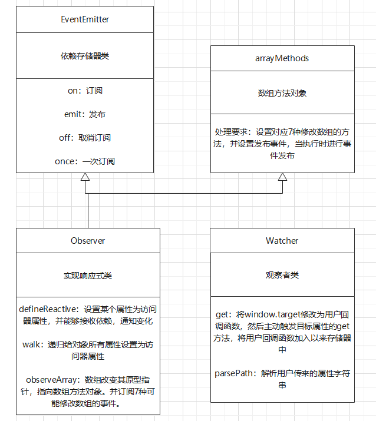

> 参考：
>
> <<深入浅出Vue.js>> 第二章 Object的变化侦测
>
> Vue2.x和Vue3.x官网关于<<深入响应式原理>>的介绍
>
> <<JavaScript权威指南(第七版)>>


### 1.追踪对象变化的方法

#### Vue2.x

在组件创建时，Vue2.x系列使用了Object.defineProperty来给组件中的data的每个属性设置为访问器属性。

**效果是：访问器属性拥有setter，可以探测到属性值的修改**

**缺点是：访问器属性具有局限性，无法探测属性的增加或删除。下面是缺点导致的后果---参考Vue2.x官网<<深入响应式原理>>**

(1) 嵌套对象添加响应式 property需要调用Vue特殊方法

使用```Vue.$set(anyObject, property, value)```或```Vue.$delete```

```javascript
let school = {
    name: "SDU",
    province: "Shan Dong"
}

// Vue组件中的data
data() {
	return {
        name: "Danny",
        school: school
    }
}

// 此变化无法被访问器属性探测
school.city = "Ji Nan"

// 需要调用Vue.$set方法
this.$set(this.school, "city", "Ji Nan")
```

(2 ) Vue 不允许动态添加根级别的响应式 property

不允许在data上添加或删除属性

```javascript
let school = {
    name: "SDU",
    province: "Shan Dong"
}

// Vue组件中的data
data() {
	return {
        name: "Danny",
        school: school
    }
}

// 给data添加一个新的属性，这是不允许的
this.gender = "male"
```


#### Vue3.x

Vue3.x使用了ES6的proxy来探测对象的变化，详情可参考Vue3.x官网<<深入响应性原理>>

**效果是：使用对象代理和对象反射可以探测到对象的所有变化，解决了Vue2.x中的响应式缺陷。**


### 2.通知模板变化的方法

注：在<<深入浅出Vue>>中这里为“收集依赖的方法”

#### 2.1 订阅发布模式

在追踪到对象的改变后，Vue需要通知到所有依赖这些对象的位置（通常指的是Vue模板template），说明对象已经发生改变。这实际上是订阅发布模式的简化版。在这里先了解并实现一个简单的订阅发布模式。参考：https://segmentfault.com/a/1190000019260857

**订阅发布模式的设计**

1. 订阅发布模式关注“订阅过程”，“发布过程”

> 实现订阅过程和发布过程需要有一个中间人。订阅者将订阅信息提交给中间人，中间人记录下来；发布者把发布信息发布给中间人，中间人查找订阅给类型信息的订阅者，将发布信息依次发送给订阅者

2. 订阅发布模式需要的数据结构如下：

​	用简易代码表示：

```javascript
// eventType(n)存储第n种事件对应的消息通知队列，队列中存储着订阅者提供的通知函数，执行该通知函数就可通知对应的订阅者
eventType1 = [() => {}, () => {}, ..., () => {}]
eventType2 = [() => {}, () => {}, ..., () => {}]
eventType3 = [() => {}, () => {}, ..., () => {}]
...
eventTypen = [() => {}, () => {}, ..., () => {}]

// eventList存储所有可能的事件类型，每种事件类型都指向一个消息通知队列
eventList = {
    eventType1,
    eventType2,
    eventType3,
    ...
    eventTypen
}
```

​	用内存图表示：


**订阅发布模式的代码：(JavaScript实现)**

```javascript
class EventEmitter{
    constructor() {
        // 事件类型对象，存储各种不同事件的通知函数队列
        this.eventList = {}
    }

    // 订阅函数
    on(eventType, notifyFunc) {
        // 如果存在该类型事件，那么直接在其订阅者队列中添加一个通知函数。否则先创建订阅者队列，之后再添加通知函数。
        (this.eventList[eventType] || (this.eventList[eventType] = [])).push(notifyFunc)
    }

    // 发布函数
    emit(eventType, ...content) {
        // 发布时，先找到该类型事件，然后执行每个订阅者的通知函数，把信息通知给这些订阅者
        this.eventList[eventType] && this.eventList[eventType].forEach(notifyFunc => notifyFunc.call(this, ...content))
    }

    // 只订阅一次
    once(eventType, notifyFunc) {
        let that = this
        // 创建一个新函数on，包装订阅者的通知函数notifyFunc
        function on(content) {
            // 当通知订阅者时，执行订阅者传来的通知函数
            notifyFunc.call(that, content)
            // 把新函数on取消订阅
            this.off(eventType, on)
        }
        // 把新函数on放入通知队列，代替  订阅者的通知函数notifyFunc
        this.on(eventType, on)
    }

    // 取消订阅
    off(eventType, notifyFunc) {
        let notifyQueue = this.eventList[eventType]
        // 取消订阅时，先判断是否存在这种事件，再判断该事件的通知队列中是否存在该通知函数
        if(notifyQueue && notifyQueue.includes(notifyFunc))
            // 存在这种函数时则删除通知队列中所有该通知函数
            for(let i = 0; i < notifyQueue.length;)
                if(notifyQueue[i] === notifyFunc)
                    notifyQueue.splice(i, 1)
                else i ++
    }
}
```

**测试订阅发布模式**

```javascript
// 创建一个“订阅发布模式”对象
let eventEmitter = new EventEmitter()

// 1.测试基础的订阅事件，假设三个同学订阅了“开学事件”
eventEmitter.on("开学", console.log)
eventEmitter.on("开学", console.log)
eventEmitter.on("开学", console.log)
// 1秒后发布“开学事件”，发布信息是开学时间
setTimeout(() => {
    eventEmitter.emit("开学", "2022/2/20")
}, 1000)


// 2.测试取消订阅
eventEmitter.on("放假", console.log)
eventEmitter.on("放假", console.log)
eventEmitter.off("放假", console.log)
// 1秒后发布“放假事件”，发布信息是放假时间
setTimeout(() => {
    eventEmitter.emit("放假", "放假时间是2022/1/8")
}, 1000)


// 3.测试只订阅一次
eventEmitter.once("社会实践", console.log)
// 1秒后发布“社会实践事件”，发布信息是社会实践时间
setTimeout(() => {
    eventEmitter.emit("社会实践", "社会实践时间是2022/1至2022/3")
}, 1000)
// 2秒后再次发布“社会实践事件”，发布信息是修改后的信息，理论上订阅一次是接收不到此次发布的信息的
setTimeout(() => {
    eventEmitter.emit("社会实践", "社会实践时间延长至2022/4")
}, 2000)

// 4.测试发布一个不存在的事件
eventEmitter.emit("放假", "2022/1/8")

// 5.测试取消订阅一个不存在的事件
eventEmitter.off("玩电脑", console.log)

// 测试结果如下
// 2022/2/20
// 2022/2/20
// 2022/2/20
// 社会实践时间是2022/1至2022/3
```


#### 2.2 基于订阅发布模式实现Vue的响应式原理---对象

**注意：**

下述代码思路参考<<深入浅出Vue.js>>，减少了原文中代码的封装性，提高了一些可读性


**1.下述代码想要模拟的场景是：**

创建一个新的Vue实例，Vue在底层将Vue实例中的data的属性全部设置为访问器属性，检测数据变化。声明一个变量，赋值为data中的某个属性，模拟Vue模板中使用数据绑定。最后改变data中的属性值，观察结果。**下述代码不考虑data中含有数组的情况**


**2.下述代码实现思路：**

在将Vue实例中的data的属性设为访问器属性时使用订阅发布模式。访问器get方法中进行订阅，传入一个通知函数，该通知函数能够通知Vue模板中所有绑定该变量的位置，该变量值发生变化。访问器set方法中进行发布，当属性值变化时，发布事件，触发通知函数，通知模板中绑定该变量的位置要更新变量值。**也可参考最后面的总结**


**3.下述代码的前提条件：**

下述代码将data的属性全部设置为访问器属性，默认是在Vue2.x环境下。如果想模拟Vue3.x环境，可将其自行换为Proxy。

在下述代码中会使用上文已经实现的EventEmitter类，虽然Vue2.x默认不在ES6环境下，没有类的概念，但是方便起见不要计较。

```javascript
// 假设window.target是如下的通知函数
globalThis.target = function(key, val, newVal) {
    console.log(key + "属性发生了改变，由" + val + "变为了" + newVal)
    // 下面的代码省略，是通知Vue模板中使用该变量的位置，该变量值发生了改变，需要更新
}

// Observer是观察类，负责将对象变为响应式
class Observer {
    constructor(value) {
        // 数组需要另外考虑
        if (!(value instanceof Array))
            this.walk(value)
    }

    // 将某个属性设置为访问器属性，以做到对属性变化的检测
    defineReactive(data, key, val) {
        // 不为所有情况创建一个全局的EventEmitter对象的原因是：eventType的表示不方便，两个对象有同名属性时需要考虑对对象进行哈希运算，否则会出现两个对象使用同一个eventType。
        // 这里牺牲空间复杂度降低时间复杂度。
        const eventEmitter = new EventEmitter()
        Object.defineProperty(data, key, {
            enumerable: true,
            configurable: true,
            // 注意这里不要使用get()增强型写法，Vue2.x的Object.defineProperty方法在设计时不是在ES6环境，否则直接使用proxy对象完成对象探测
            get: function() {
                // 这里假设一个不存在的window.target属性为通知函数，真正的Vue的通知函数要复杂，这里使用window.target代指之。
                if(globalThis.target)
                    // 这里的eventType随便命名即可，订阅时传入通知函数
                    eventEmitter.on("change", globalThis.target)
                return val
            },
            set: function(newVal) {
                if(val === newVal)
                    return
                // 当属性值发生改变时，先更新属性值，然后发布更新信息
                eventEmitter.emit("change", key, val, newVal)
                val = newVal
            }
        })
    }

    // 将传入对象的所有属性设置为访问器属性
    walk(value) {
        // 这里不考虑符号属性，keys只能获取自有可枚举非符号属性
        const keys = Object.keys(value)
        for(let key of keys) {
            // 先不考虑数组的情况
            if(typeof value[key] === "object" && !(value[key] instanceof Array)) {
                this.defineReactive(value, key, value[key])
                this.walk(value[key])
            } else this.defineReactive(value, key, value[key])
        }
    }
}
```

**4.测试上述代码**

```javascript
// 测试响应式原理
// 下面的data对象模拟Vue中的data
let data = {
    name: "Danny",
    gender: "male",
    school: {
        name: "SDU",
        grade: [1, 2, 3],
        location: {
            province: "Shandong",
            city: "WeiHai"
        }
    }
}

let observer = new Observer(data)

// 模拟Vue模板中使用data中的数据
let gender = data.gender
// data中的数据发生变化，将会通知模板中使用该变量的位置。此处使用let模拟模板，无法改变let声明的变量的值，理解意思即可。
data.gender = "female"

// 模拟Vue模板中使用data中的数据
let schoolName = data.school.name
// data中的数据发生变化，将会通知模板中使用该变量的位置。此处使用let模拟模板，无法改变let声明的变量的值，理解意思即可。
data.school.name = "PKU"

// 预计输出结果，输出原因是通知函数
// gender属性发生了改变，由male变为了female
// name属性发生了改变，由SDU变为了PKU
```


#### 2.3 基于订阅发布模式实现Vue的响应式原理---数组

**1.下述代码想要模拟的场景是：**

2.3像模拟的情况和2.2相同，只不过是考虑data中有数组的情况，数组的响应式处理和对象不同。

**2.下述代码的思路：**

在Vue2.x中对数组响应式处理有几条要求（与处理对象不同，也受制于非ES6环境）。1.数组本身的修改是响应式的，即栈内存的改变；2.数组元素中的非引用类型不是响应式的；3.修改数组的方法是响应式的（push，pop，unshift，shift，splice，sort，reverse）。第一个和第二个要求容易实现，实现思路和处理对象一样。第三个要求实现思路是延长数组的原型链，创建一个继承自Array的对象，拥有上述7种方法，并在其中收集“依赖”，即订阅消息。之后改变数组的原型指针，指向这个新创建的对象。

```javascript
class Observer {
    constructor(value) {
        this.value = value
        this.eventEmitter = new EventEmitter()
        // 如果传入一个数组，那么更改其原型为数组方法对象，起到拦截效果
        if(value instanceof Array)
            this.observeArray(value)
        else
            // 如果不是数组，那么就正常将其变为响应式
            this.walk(value)
        // 为要变为响应式的对象添加一个属性“__ob__”，让其能够访问到访问器。目的是让数组拦截器能够访问到observer对象，实现通知
        value["__ob__"] = this
    }

    // 将某个属性设置为访问器属性，以做到对属性变化的检测
    defineReactive(data, key, val) {
        // 不为所有情况创建一个全局的EventEmitter对象的原因是：eventType的表示不方便，两个对象有同名属性时需要考虑对对象进行哈希运算，否则会出现两个对象使用同一个eventType。
        // 这里牺牲空间复杂度降低时间复杂度。
        const eventEmitter = new EventEmitter()
        Object.defineProperty(data, key, {
            enumerable: true,
            configurable: true,
            // 注意这里不要使用get()增强型写法，Vue2.x的Object.defineProperty方法在设计时不是在ES6环境，否则直接使用proxy对象完成对象探测
            get: function() {
                // 这里假设一个不存在的window.target属性为通知函数，真正的Vue的通知函数要复杂，这里使用window.target代指之。
                if(globalThis.target)
                    // 这里的eventType随便命名即可，订阅时传入通知函数
                    eventEmitter.on("change", globalThis.target)
                return val
            },
            set: function(newVal) {
                if(val === newVal)
                    return
                // 当属性值发生改变时，先更新属性值，然后发布更新信息
                eventEmitter.emit("change", key, val, newVal)
                val = newVal
            }
        })
    }

    // 当前处理元素为对象，递归将其属性设置为访问器属性
    walk(value) {
        // 这里不考虑符号属性，keys只能获取自有可枚举非符号属性
        const keys = Object.keys(value)
        for(let key of keys) {
            let val = value[key]
            // 先不考虑数组的情况
            if(typeof val === "object" && !(val instanceof Array)) {
                this.defineReactive(value, key, val)
                this.walk(val)
            } else if(val instanceof Array) {
                this.defineReactive(value, key, val)
                new Observer(val)
            } else this.defineReactive(value, key, val)
        }
    }

    // 当前处理元素为数组
    observeArray(value) {
        // 只是理解原理，这里就不做特判是否存在__proto__属性了，Vue.js源码中有相关处理
        value.__proto__ = arrayMethods
        // 数组本身订阅一个更改事件，当数组调用能修改自身的7种方法时会接受到通知
        this.eventEmitter.on("change", globalThis.target)
    }
}
}
```

**3.测试上述代码：**

```javascript
// 测试响应式原理
// 下面的data对象模拟Vue中的data
let data = {
    name: "Danny",
    gender: "male",
    school: {
        name: "SDU",
        grade: [1, 2, 3],
        location: {
            province: "Shandong",
            city: "WeiHai"
        }
    }
}

let observer = new Observer(data)
// let模拟Vue模板中使用数据
// let grade相当于Vue模板中引用了grade，例如v-for指令，此语句模拟Html中的数据绑定
let grade = data.school.grade
// 此语句模拟在js中修改data中grade的值，预期修改后会通知模板中所有绑定该变量的位置
grade.push(22)

// 此语句模拟在js中修改data中grade的值，预期修改后会通知模板中所有绑定该变量的位置
data.school.grade = []

// 预期输出
// [1,2,3]属性发生了改变，由[1,2,3]变为了[1,2,3,22]
// grade属性发生了改变，由1,2,3,22变为了
```


#### 2.4 Vue响应式原理实现vm.$watch

**注意：**

在Vue官网中关于vm.$watch的介绍比较简略，但是不影响理解它的含义。在<<深入浅出Vue.js>>中主要在第四章介绍vm.$watch，但是第二章也有所涉及。


**1.回顾：**

在2.2中实现了基础的Vue响应式原理，主要是考虑了两个方面：1.如何追踪对象的变化——使用访问器属性 2.如何将对象的变化通知给模板——使用订阅发布模式。


**2.vm.$watch：**

但是在实际的Vue响应式实现中考虑了更灵活的应用场景，用户应也可以监听对象的变化。Vue提供了更高封装程度的vm.$watch代替访问器属性，让用户更容易监听对象变化。使用```vm.$watch(property, callback)```的效果是，当指定的Vue实例的data中的property发生变化后，会执行callback函数。


**3.vm.$watch的实现：**

下述代码实现了Watcher类，效果和vm.$watch大致相同，使用方法不同。但效果都是能够让用户监听到对象的变化。将下述代码和2.2中实现的代码结合即可。

```javascript
class Watcher {
    // expOrFn为属性表达式，详情参见Vue官网关于vm.$watch的使用，expOrFn对应其第一个参数。在这里的实现中vm指的是Vue实例的data对象。
    constructor(vm, expOrFn, callback) {
        this.vm = vm
        this.expOrFn = expOrFn
        this.callback = callback
        this.value = this.get()
    }

    get() {
        globalThis.target = (key, val, newVal) => {
            this.callback.call(this.vm, val, newVal)
            this.value = this.get()
        }

        // 访问data.expOrFn对应的属性，此时会触发访问器属性get，get中会加入globalThis.target，此时的globalThis.target已经修改成了用户希望的回调函数
        let value = Watcher.parsePath(this.expOrFn).call(this, this.vm)

        // 将globalThis.target还原，上文globalThis的值就如下
        globalThis.target = function(key, val, newVal) {
            console.log(key + "属性发生了改变，由" + val + "变为了" + newVal)
            // 下面的代码省略，是通知Vue模板中使用该变量的位置，该变量值发生了改变，需要更新
        }
        return value
    }

    // 解析传入的属性expOrFn，比如"a.b.c"，结果是obj.a.b.c
    static parsePath(expOrFn) {
        let segments = expOrFn.split(".")
        return function(obj) {
            for(let i = 0; i < segments.length; i ++)
                if(!obj)
                    return
                else
                    obj = obj[segments[i]]
            return obj
        }
    }
}
```

**4.代码测试：**

在将上述代码和2.1,2.2,2.3的代码结合后做下述测试

```javascript
// 下面的data对象模拟Vue中的data
let data = {
    name: "Danny",
    gender: "male",
    school: {
        name: "SDU",
        grade: [1, 2, 3],
        location: {
            province: "Shandong",
            city: "WeiHai"
        }
    }
}

// 将data对象的属性全部变为访问器属性
let observer = new Observer(data)

// 使用Watcher对象使得用户可以监听到对象的变化
new Watcher(data, "school.name", function(val, newVal) {
    console.log("使用watcher监听到了对象的变化","老属性值是" + val, "新属性值是" + newVal)
})

// 对象发生变化
data.school.name = "PKU"

// 预计输出结果
// 使用watcher监听到了对象的变化 老属性值是SDU 新属性值是PKU
```


### 3.实现响应式的完整代码

注：这是参考了Vue源码的思路，去掉一些复杂情况的特判，在某些地方加入了自己的理解的实现

```javascript
class EventEmitter{
    constructor() {
        // 事件类型对象，存储各种不同事件的通知函数队列
        this.eventList = {}
    }

    // 订阅函数
    on(eventType, notifyFunc) {
        // 如果存在该类型事件，那么直接在其订阅者队列中添加一个通知函数。否则先创建订阅者队列，之后再添加通知函数。
        (this.eventList[eventType] || (this.eventList[eventType] = [])).push(notifyFunc)
    }

    // 发布函数
    emit(eventType, ...content) {
        // 发布时，先找到该类型事件，然后执行每个订阅者的通知函数，把信息通知给这些订阅者
        this.eventList[eventType] && this.eventList[eventType].forEach(notifyFunc => notifyFunc.call(this, ...content))
    }

    // 只订阅一次
    once(eventType, notifyFunc) {
        let that = this
        // 创建一个新函数on，包装订阅者的通知函数notifyFunc
        function on(content) {
            // 当通知订阅者时，执行订阅者传来的通知函数
            notifyFunc.call(that, content)
            // 把新函数on取消订阅
            this.off(eventType, on)
        }
        // 把新函数on放入通知队列，代替  订阅者的通知函数notifyFunc
        this.on(eventType, on)
    }

    // 取消订阅
    off(eventType, notifyFunc) {
        let notifyQueue = this.eventList[eventType]
        // 取消订阅时，先判断是否存在这种事件，再判断该事件的通知队列中是否存在该通知函数
        if(notifyQueue && notifyQueue.includes(notifyFunc))
            // 存在这种函数时则删除通知队列中所有该通知函数
            for(let i = 0; i < notifyQueue.length;)
                if(notifyQueue[i] === notifyFunc)
                    notifyQueue.splice(i, 1)
                else i ++
    }
}

// 假设window.target是如下的通知函数
globalThis.target = function(key, val, newVal) {
    console.log(key + "属性发生了改变，由" + val + "变为了" + newVal)
    // 下面的代码省略，是通知Vue模板中使用该变量的位置，该变量值发生了改变，需要更新
}

// 创建数组方法对象，继承于数组类
// 看似数组方法对象继承于数组类相似类，但实际上数组方法对象要用作原型，就像“寄生组合继承”中的优化机制一样
const arrayMethods = Object.create(Array.prototype);

// 给数组方法对象添加方法，这些方法会修改数组本身，我们需要拦截监听，实现响应式
["push", "pop", "unshift", "shift", "sort", "reverse", "splice"].forEach(method => {
    const originalMethod = Array.prototype[method]
    Object.defineProperty(arrayMethods, method, {
        enumerable: false,
        writable: true,
        configurable: true,
        value: function (...args) {
            // 保存数组该方法执行前的状态
            let that = this.slice(0)
            // 执行此方法
            let res =originalMethod.call(this, ...args)
            // 通知数组，数组自身发生改变
            this.__ob__.eventEmitter.emit("change", `[${that.join(",")}]`, `[${that.join(",")}]`, `[${this.join(",")}]`)
            return res
        }
    })
})

class Observer {
    constructor(value) {
        this.value = value
        this.eventEmitter = new EventEmitter()
        // 如果传入一个数组，那么更改其原型为数组方法对象，起到拦截效果
        if(value instanceof Array)
            this.observeArray(value)
        else
            // 如果不是数组，那么就正常将其变为响应式
            this.walk(value)
        // 为要变为响应式的对象添加一个属性“__ob__”，让其能够访问到访问器。目的是让数组拦截器能够访问到observer对象，实现通知
        value["__ob__"] = this
    }

    // 将某个属性设置为访问器属性，以做到对属性变化的检测
    defineReactive(data, key, val) {
        // 不为所有情况创建一个全局的EventEmitter对象的原因是：eventType的表示不方便，两个对象有同名属性时需要考虑对对象进行哈希运算，否则会出现两个对象使用同一个eventType。
        // 这里牺牲空间复杂度降低时间复杂度。
        const eventEmitter = new EventEmitter()
        Object.defineProperty(data, key, {
            enumerable: true,
            configurable: true,
            // 注意这里不要使用get()增强型写法，Vue2.x的Object.defineProperty方法在设计时不是在ES6环境，否则直接使用proxy对象完成对象探测
            get: function() {
                // 这里假设一个不存在的window.target属性为通知函数，真正的Vue的通知函数要复杂，这里使用window.target代指之。
                if(globalThis.target)
                    // 这里的eventType随便命名即可，订阅时传入通知函数
                    eventEmitter.on("change", globalThis.target)
                return val
            },
            set: function(newVal) {
                if(val === newVal)
                    return
                // 当属性值发生改变时，先更新属性值，然后发布更新信息
                eventEmitter.emit("change", key, val, newVal)
                val = newVal
            }
        })
    }

    // 当前处理元素为对象，递归将其属性设置为访问器属性
    walk(value) {
        // 这里不考虑符号属性，keys只能获取自有可枚举非符号属性
        const keys = Object.keys(value)
        for(let key of keys) {
            let val = value[key]
            // 先不考虑数组的情况
            if(typeof val === "object" && !(val instanceof Array)) {
                this.defineReactive(value, key, val)
                this.walk(val)
            } else if(val instanceof Array) {
                this.defineReactive(value, key, val)
                new Observer(val)
            } else this.defineReactive(value, key, val)
        }
    }

    // 当前处理元素为数组
    observeArray(value) {
        // 只是理解原理，这里就不做特判是否存在__proto__属性了，Vue.js源码中有相关处理
        value.__proto__ = arrayMethods
        // 数组本身订阅一个更改事件，当数组调用能修改自身的7种方法时会接受到通知
        this.eventEmitter.on("change", globalThis.target)
    }
}
class Watcher {
    // expOrFn为属性表达式，详情参见Vue官网关于vm.$watch的使用，expOrFn对应其第一个参数。在这里的实现中vm指的是Vue实例的data对象。
    constructor(vm, expOrFn, callback) {
        this.vm = vm
        this.expOrFn = expOrFn
        this.callback = callback
        this.value = this.get()
    }

    get() {
        globalThis.target = (key, val, newVal) => {
            this.callback.call(this.vm, val, newVal)
            this.value = this.get()
        }

        // 访问data.expOrFn对应的属性，此时会触发访问器属性get，get中会加入globalThis.target，此时的globalThis.target已经修改成了用户希望的回调函数
        let value = Watcher.parsePath(this.expOrFn).call(this, this.vm)

        // 将globalThis.target还原，上文globalThis的值就如下
        globalThis.target = function(key, val, newVal) {
            console.log(key + "属性发生了改变，由" + val + "变为了" + newVal)
            // 下面的代码省略，是通知Vue模板中使用该变量的位置，该变量值发生了改变，需要更新
        }
        return value
    }

    // 解析传入的属性expOrFn，比如"a.b.c"，结果是obj.a.b.c
    static parsePath(expOrFn) {
        let segments = expOrFn.split(".")
        return function(obj) {
            for(let i = 0; i < segments.length; i ++)
                if(!obj)
                    return
                else
                    obj = obj[segments[i]]
            return obj
        }
    }
}
```


### 4.Vue响应式是异步更新DOM

在Vue官网中介绍<<深入响应式原理>>时提到Vue的DOM更新是异步的，如果想在DOM更新后执行某些回电函数，那么需要使用Vue.$nextTick()。


这里有些困惑，在本人另一篇博客“浏览器事件”中提到了浏览器更新DOM的时机。根据WhatWG官方文档介绍，浏览器先执行task(就是通常讲的宏任务，只不过第一个task是JavaScript同步代码)，之后执行microtask，再之后才进行DOM更新。因此我猜想Vue.$nextTick()的实现会用到宏任务，这样会在DOM更新后执行回调。但是在查阅了源码（在node_modules/vue/src/core中）后发现实现中可以使用微任务也可以使用宏任务。在参考了https://segmentfault.com/q/1010000039973370后，本人推测应该与Vue的虚拟DOM有关。此问题将在完成虚拟DOM学习后再详细考虑。


### 4.总结

**1.官网总结：**

总结借用Vue官网关于响应式介绍的图。Watcher就是上面实现的Watcher类，或者说就是vm.$watch()对应上述的2.3。Data的访问器方法实现对象变化侦测对应上文的1。虚线具体的步骤都在代码实现中体现出来。关于虚拟DOM可以暂时忽视。


**2.用类图来梳理上述代码的逻辑**




**3.核心逻辑梳理：**

* 对象变化为响应式：

  1. 对象依赖的收集： 在访问器属性的get中

  2. 对象变化的通知：在访问器属性的set中

     

* 数组变化为响应式：

  1. 数组依赖的收集：在访问器属性的get中和observerArray中(收集7种改变数组的方法造成的影响)

  2. 数组变化的通知：在访问器属性的set中和数组方法对象的方法中

     

* 数组发生响应式改变的因素：

  	1. 数组栈内存改变
  	1. 数组引用类型元素发生改变
  	1. 调用改变数组的7种方法

  

* 用户自定义监听事件：

  1. 更改window.target为用户自定义回调函数
  2. 主动触发对应属性的get方法
  3. 触发get后自动将回调函数加入依赖存储器
  4. 恢复window.target原值
