# 1.Vue中虚拟DOM的诞生原因

### 1.1 Vue中的MVVM框架

**1. View： **DOM和CSSOM是View部分，负责视图

**2. ViewModel： **Vue框架是ViewModel部分，负责双向数据绑定

**3. Model：** Vue框架下的JavaScript代码是是Model部分，负责提供数据和操作

**4. 双向数据绑定：** 在“Vue深入响应式原理”这篇博客中，已经探究并实现了Vue中的数据绑定。即在ViewModel中实现绑定机制，使Model中的数据变化会导致View的变化。这是一个Model到View的单向数据绑定。从View到Model的数据绑定可以用户自己实现，只需要用户监听到View中的事件后修改Model中的数据即可；从View到Model的数据绑定也可以用Vue提供的v-model实现。

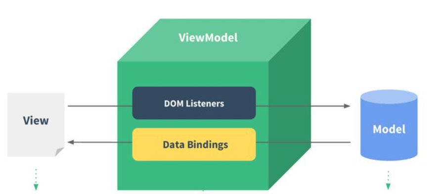


### 1.2 MVVM设计模式解决的问题

MVVM设计模式让开发者将更多精力放在Model中的数据维护上面。在传统的开发中要维护的状态很多，必须考虑到对DOM的操作。下面举例描述：

> 要实现一个表格排序功能，表格中有若干字段，要求表格能够根据不同字段的升序或降序对表格进行排序。

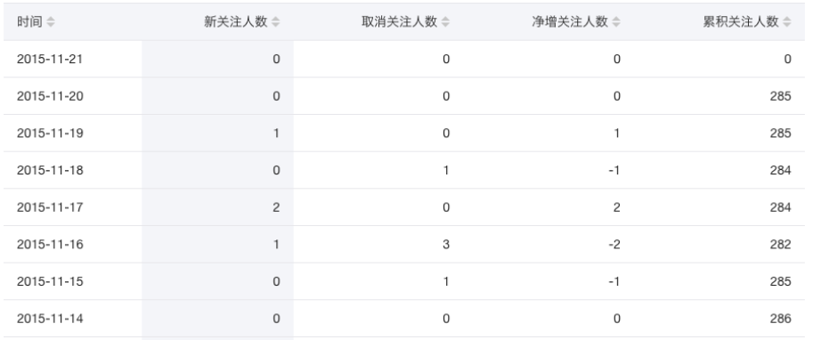

#### 1.2.1 传统方法解决：

> **使用传统web开发的实现思路：**
>
> 1. 收集表格中的所有数据，对其按照某个关键字进行排序。之后操作DOM对表格内容进行完全更新。在1方法的基础上稍作修改，
> 2. 在排序时涉及到元素位置的交换，可以在元素位置交换时同时对表格中的DOM元素进行位置交换。
>
> **使用传统web开发的实现的缺点：**
>
> 1. **（存在无效渲染）** 假如按照不同字段进行升序降序排序对表格内容的影响较小，即表格内容改变不大。此时对表格整体进行DOM更新不是最优操作，最优操作是仅仅修改需要更新的DOM节点即可。
> 2. **（维护状态多）** 开发者需要维护的状态较多，开发者不仅要考虑数据的状态，还有考虑DOM元素的状态，需要手动操纵DOM。


#### 1.2.2 MVVM设计模式解决：

> **使用MVVM设计模式的实现思路：**
>
> 1. 实现“Vue深入响应式原理”博客中实现的数据监听机制，当监听到对应数据变化时，通知对应的DOM发生变化或通知整体DOM发生变化。
>
> **使用MVVM设计模式的实现的缺点：**
>
> 1. **（存在无效渲染）** 在排序时数据会发生多次变化，数据一变化就MVVM设计模式会通知DOM发生对应的变化，实际上我们只需要知道最后DOM是什么样，让DOM变化成这样即可，在数据排序过程中的DOM变化是不需要的。
>
> **使用MVVM设计模式的实现的优点：**
>
> 1.  **（减少状态）**  MVVM设计模式可以将DOM操作封装到底层，让用户只关注数据的状态。


#### 1.2.3 改进的MVVM设计模式解决：

>**使用改进MVVM设计模式的实现思路：**
>
>1. 首先实现MVVM设计模式，另外创建一个对象记录当前数据状态。当数据改变后，对比改变前后数据的差别，再决定对表格中哪些DOM进行修改
>
>**使用改进的MVVM设计模式的实现的优点：**
>
>1. **（减少状态）** 改进的MVVM设计模式本身是在MVVM上改进，因此具备MVVM的本质优点
>2. **（减少无效渲染）** 由于记录对象的存在，使得可以对比变化前后数据的差异，从而更新需要更新的DOM，因此减少了无效渲染。


**实际上改进的MVVM设计模式就是虚拟DOM，这就是虚拟DOM诞生的原因，是为了解决MVVM设计模式中的视图更新问题。**下文将继续介绍Vue中虚拟DOM诞生的原因。


### 1.3 Vue组件化开发带来的渲染问题

Vue大型项目的开发是组件化的，每个组件都应用了上文提到的MVVM设计模式

#### 1.3.1 组件化开发中高细粒度数据绑定：

在Vue1.x系列中Vue实现了MVVM高细粒度的数据绑定，**监听每个组件中的所有数据**，一旦某个数据发生改变，就修改DOM。

> 优点：使用了MVVM设计模式，让开发者只需要关注数据，简化开发逻辑。
>
> 缺点：高细粒度的绑定需要大量内存开销。

#### 1.3.2 组件化开发中中细粒度数据绑定：

在Vue2.x系列中实现了MVVM中等细粒度的数据绑定，**监听每个组件**，一旦某个组件发生变化，就更新这个组件的DOM。

> 优点：解决了Vue1.x中的大量内存开销。
>
> 缺点：组件中可能某个数据变化仅涉及一个DOM修改操作但是缺刷新了整个组件的DOM。

#### 1.3.3 Vue虚拟DOM产生原因：

为了解决Vue2.x数据中等细粒度数据绑中低性能渲染DOM的问题，Vue2.x开始采取了虚拟DOM来解决这个问题。虚拟DOM使得Vue2.x能够比Vue1.x节省能存开销的同时，也能像Vue1.x中那样修改DOM，而不是组件变化后刷新组件整个DOM。虚拟DOM的职责就是数据变化后寻找组件中哪些DOM需要发生改变。


### 1.4 总结：

对于虚拟DOM来说，可以用下述语句来概括

1. **（Vue虚拟DOM产生原因）**Vue中虚拟DOM产生的原因是为了解决Vue2.x版本中等细粒读数据绑定的组件的渲染性能问题。
2. **（虚拟DOM产生原因）**虚拟DOM的产生是为了解决MVVM设计模式中视图更新的渲染性能问题。

3. **（虚拟DOM不优化原生DOM操作）**虚拟DOM并不是优化原生DOM操作，原生DOM的优化是减少回流重绘的次数。(可参考另两篇博客“浏览器渲染”和“浏览器事件”中对渲染问题的描述)


# 2.Vue中虚拟DOM的数据结构

```javascript
export default class VNode {
  tag: string | void;
  data: VNodeData | void;
  children: ?Array<VNode>;
  text: string | void;
  elm: Node | void;
  ns: string | void;
  context: Component | void; // rendered in this component's scope
  functionalContext: Component | void; // only for functional component root nodes
  key: string | number | void;
  componentOptions: VNodeComponentOptions | void;
  componentInstance: Component | void; // component instance
  parent: VNode | void; // component placeholder node
  raw: boolean; // contains raw HTML? (server only)
  isStatic: boolean; // hoisted static node
  isRootInsert: boolean; // necessary for enter transition check
  isComment: boolean; // empty comment placeholder?
  isCloned: boolean; // is a cloned node?
  isOnce: boolean; // is a v-once node?

  constructor (
    tag?: string,
    data?: VNodeData,
    children?: ?Array<VNode>,
    text?: string,
    elm?: Node,
    context?: Component,
    componentOptions?: VNodeComponentOptions
  ) {
    /*当前节点的标签名*/
    this.tag = tag
    /*当前节点对应的对象，包含了具体的一些数据信息，是一个VNodeData类型，可以参考VNodeData类型中的数据信息*/
    this.data = data
    /*当前节点的子节点，是一个数组*/
    this.children = children
    /*当前节点的文本*/
    this.text = text
    /*当前虚拟节点对应的真实dom节点*/
    this.elm = elm
    /*当前节点的名字空间*/
    this.ns = undefined
    /*编译作用域*/
    this.context = context
    /*函数化组件作用域*/
    this.functionalContext = undefined
    /*节点的key属性，被当作节点的标志，用以优化*/
    this.key = data && data.key
    /*组件的option选项*/
    this.componentOptions = componentOptions
    /*当前节点对应的组件的实例*/
    this.componentInstance = undefined
    /*当前节点的父节点*/
    this.parent = undefined
    /*简而言之就是是否为原生HTML或只是普通文本，innerHTML的时候为true，textContent的时候为false*/
    this.raw = false
    /*静态节点标志*/
    this.isStatic = false
    /*是否作为跟节点插入*/
    this.isRootInsert = true
    /*是否为注释节点*/
    this.isComment = false
    /*是否为克隆节点*/
    this.isCloned = false
    /*是否有v-once指令*/
    this.isOnce = false
  }

  // DEPRECATED: alias for componentInstance for backwards compat.
  /* istanbul ignore next https://github.com/answershuto/learnVue*/
  get child (): Component | void {
    return this.componentInstance
  }
}
```

上述代码是Vue源代码中创建虚拟DOM节点用到的节点数据结构。

需要注意几点：

1. 虚拟DOM节点持有对应DOM节点的引用
2. 虚拟DOM节点分为如下几类：
   * 注释节点
   * 文本节点
   * 元素节点（一定有children，可以为空）
   * 组件节点（web组件，可参考《JavaScript权威指南》关于web组件的描述）
   * 函数式节点
   * 克隆节点


# 3.Vue虚拟DOM中的补丁算法（patching algorithm）

### 3.1 补丁算法

> 源代码位置是node_modules/vue/src/vdom/patch.js
>
> 流程图摘自《深入浅出Vue.js》

1. 在Vue2.x版本中补丁算法工作时间是组件中数据发生变化时。补丁算法会对遍历虚拟DOM的所有节点，并和旧虚拟DOM树的节点做对比，比较是否发生变化，从而决定DOM操作。下面的算法流程是对源代码中“patch函数”的描述，即对一对新旧虚拟DOM节点的对比流程。
2. 下述流程图可以大致分为两个部分。部分一：新旧虚拟DOM节点的简单判断，即新旧DOM节点不考虑子节点的情况。部分二：即为红框内的部分，是对比新旧虚拟DOM节点的子节点的变化，是补丁算法的核心部分。

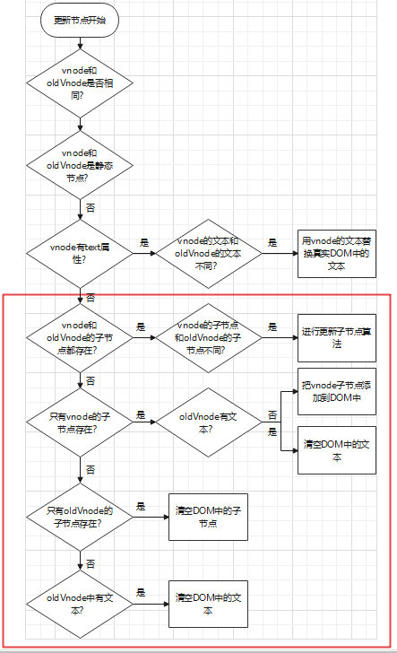

### 3.2 补丁算法核心算法——子节点更新算法

当vnode和oldVnode存在children时进行子节点更新算法。vnode和oldVnode的子节点进行对比，对比过程中对DOM进行更新。

#### 3.2.1 子节点插入

1. 从vnode的第一个子节点开始遍历，oldVnode子节点标记为未处理。

2. 如果在oldVnode的子节点找不到与当前节点相同的节点，那么将vnode的当前节点插入DOM中第一个未处理节点之前。

#### 3.2.2 子节点更新

1. 从vnode的第一个子节点开始遍历，oldVnode子节点标记为未处理。
2. 如果在oldVnode的子节点的相同位置找到与当前节点相同的节点，判断两者是否相同，若不同，则在DOM上对应位置更新。
3. oldVnode被找到的这个节点标记为已处理。

#### 3.2.3 子节点移动

1. 从vnode的第一个子节点开始遍历，oldVnode子节点标记为未处理。
2. 如果在oldVnode的子节点的不同位置找到与当前节点相同的节点，在DOM上移动当前oldVnode对应节点到该节点在vnode中的位置，之后以vnode中的节点更新此节点。
3. oldVnode被找到的这个节点标记为已处理。

#### 3.2.4 子节点删除

1. 从vnode的第一个子节点开始遍历，oldVnode子节点标记为未处理。
2. 当遍历结束后，oldVnode中剩下的节点都从DOM中删除。


### 3.3 子节点更新算法优化

在3.2中描述了基本的子节点更新算法，但实际上Vue中并不是这样实现子节点更新。上述子节点更新中每一个vnode中的子节点都需要在oldVnode的子节点中遍历一遍，来确定是否有节点和自己相同。这样的时间复杂度比较高，下面介绍Vue源码中的实际优化策略。

> 源代码位置是node_modules/vue/src/vdom/patch.js中的updateChildren函数


#### 3.3.1 优化策略1：4指针查询

源代码中设置了四个指针：```newStartIdx，newEndIdx，oldStartIdx，oldEndVnode```。前两个指向vnode子节点的第一个元素和最后一个元素，后两个指向oldVnode子节点的第一个元素和最后一个元素。

**实现优化：**

> 边界条件：```newStartIdx <= newEndIdx && oldStartIdx <= oldEndVnode```
>
> 
>
> 第一步：比较```newStartIdx```和```oldStartIdx```指向的虚拟DOM节点是否相同，相同则更新DOM并让```newStartIdx```和```oldStartIdx```指向下一个节点，不同则进行第二步。
>
> 
>
> 第二步：比较```newStartIdx```和```oldEndIdx```指向的虚拟DOM节点是否相同，相同则更新并位移DOM并让```newStartIdx```指向下一个节点让```oldEndIdx```指向上一个节点，不同则进行第三步。
>
> 
>
> 第三步：比较```newEndIdx```和```oldEndIdx```指向的虚拟DOM节点是否相同，相同则更新DOM并让```newEndIdx```和```oldEndIdx```指向上一个节点，不同则进行第四步。
>
> 
>
> 第四步：比较```newEndIdx```和```oldStartIdx```指向的虚拟节点是否相同，相同则更新并位移DOM并让```newEndIdx```指向上一个节点让```oldStartIdx```指向下一个节点，不同则指向优化策略2。


#### 3.3.2 优化策略2：key映射

当优化策略1不起作用时意味着我们不得不遍历oldVnode的子节点来确定是否有一个元素与vnode子节点中当前节点相同。但是还有一个优化策略来避免这种情况发生。

**实现优化：**

> key映射表示，在Vue模板中使用列表渲染时绑定key值。当在模板中绑定key值后，vnode的每个子节点和oldVnode的每个子节点都会有一个key属性。之后需要建立一个映射表，牺牲空间复杂度换取时间复杂度，映射表每个键值对的键是key，值是当前key对应的节点在子节点数组中的下标。这样在查询oldVnode的子节点时时间复杂度就降低到O(1)了。


注意：Vue官方文档做了以下提示，key值不允许对象，key值应该是一个稳定不变值，否则上述key映射将不起作用。


#### 3.3.3 子节点更新举例

> 引用该文章的示例：https://mp.weixin.qq.com/s?__biz=MzAxOTczMjg2MA==&mid=2247484912&idx=1&sn=6d8691915c369f4cddc595f3cb609010&source=41#wechat_redirect

整体策略为：深度优先，同层比较

1. 比较只会在同层级进行, 不会跨层级比较

   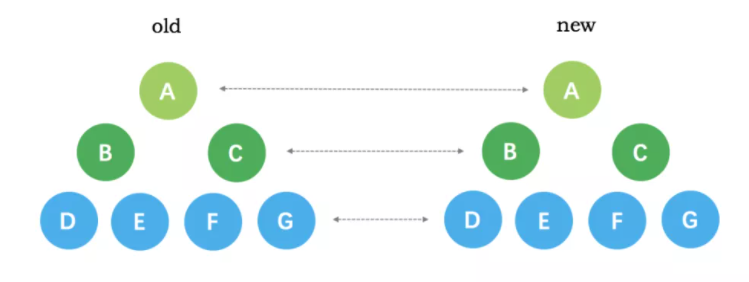

   2. 比较的过程中，循环从两边向中间收拢

      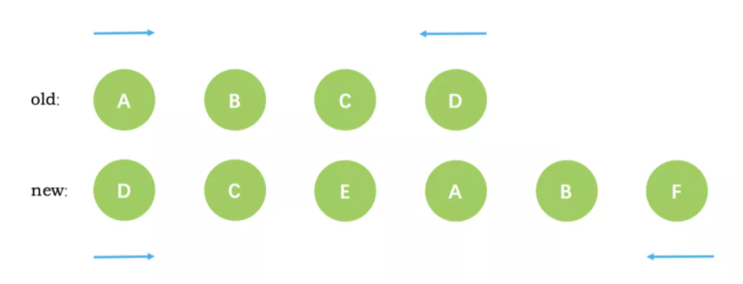

   下面举个更新的例子：

   新旧`VNode`节点如下图所示：**注：下面的diff实际指的就是真实的DOM**

   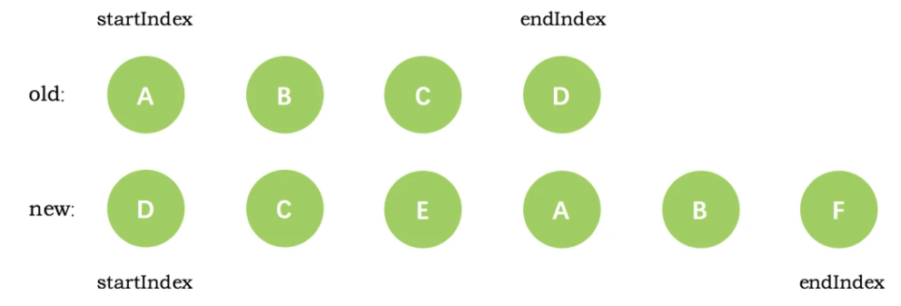

   第一次循环后，发现旧节点D与新节点D相同，直接复用旧节点D作为`diff`后的第一个真实节点，同时旧节点`endIndex`移动到C，新节点的 `startIndex` 移动到了 C

   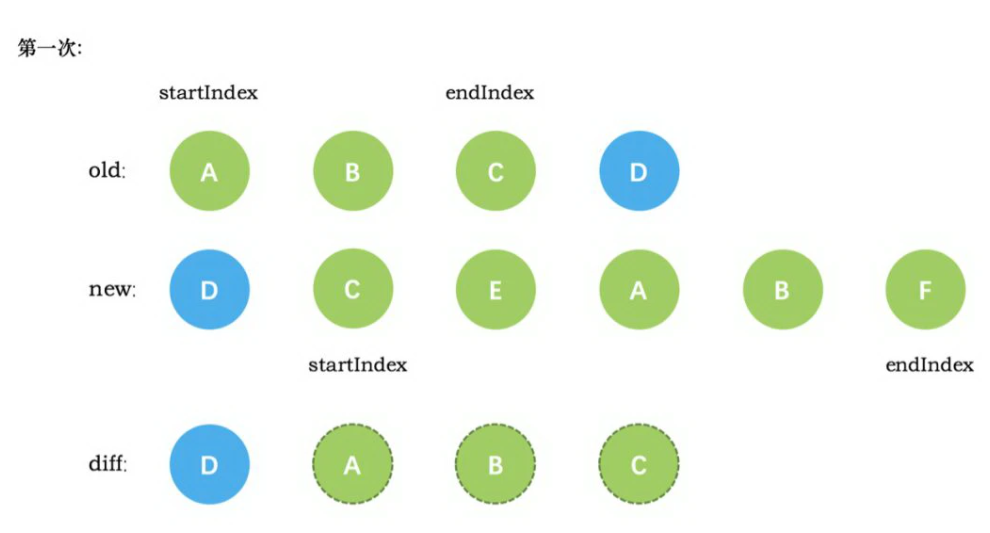

第二次循环后，同样是旧节点的末尾和新节点的开头(都是 C)相同，同理，`diff` 后创建了 C 的真实节点插入到第一次创建的 B 节点后面。同时旧节点的 `endIndex` 移动到了 B，新节点的 `startIndex` 移动到了 E

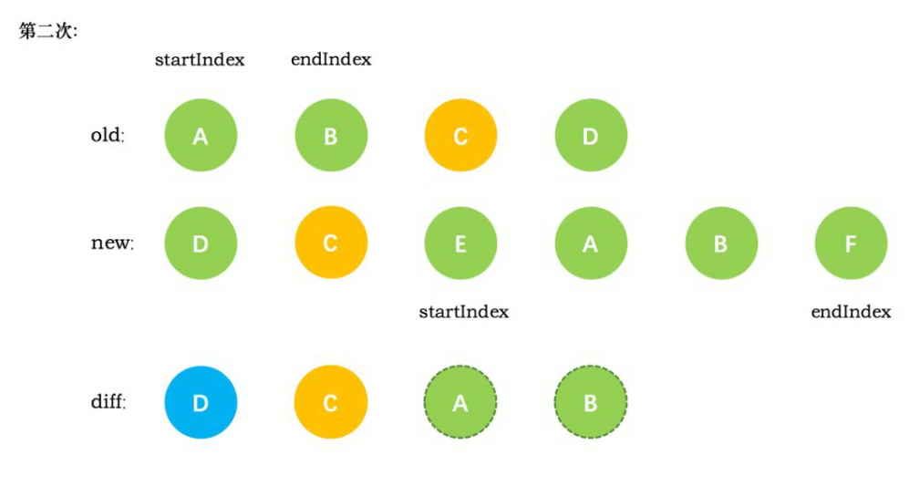

第三次循环中，发现E没有找到，这时候只能直接创建新的真实节点 E，插入到第二次创建的 C 节点之后。同时新节点的 `startIndex` 移动到了 A。旧节点的 `startIndex` 和 `endIndex` 都保持不动

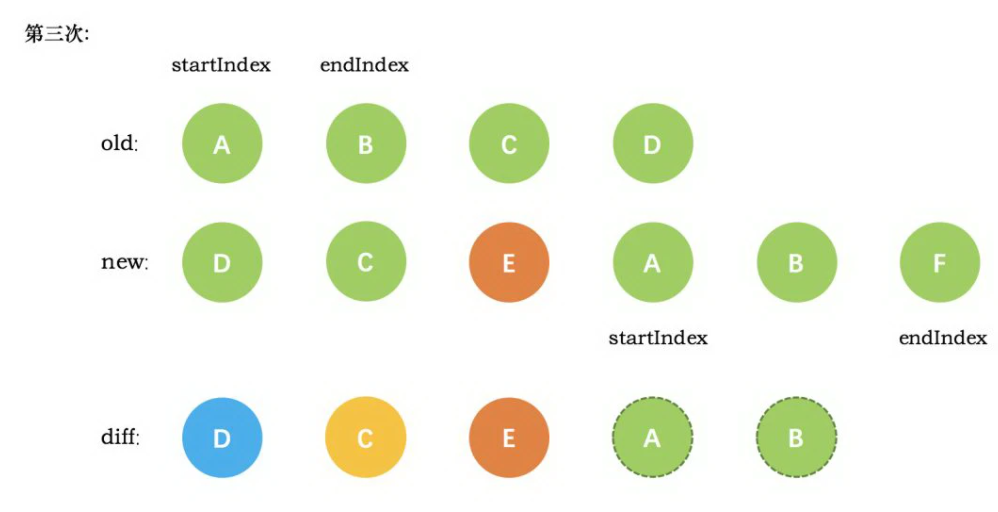

第四次循环中，发现了新旧节点的开头(都是 A)相同，于是 `diff` 后创建了 A 的真实节点，插入到前一次创建的 E 节点后面。同时旧节点的 `startIndex` 移动到了 B，新节点的`startIndex` 移动到了 B

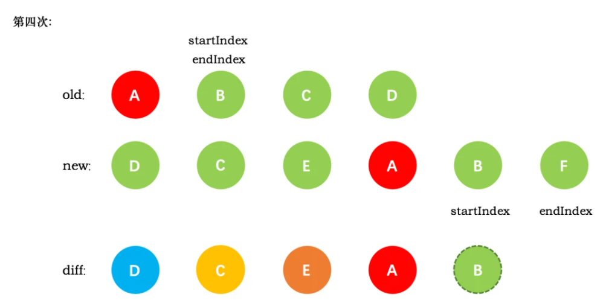

第五次循环中，情形同第四次循环一样，因此 `diff` 后创建了 B 真实节点 插入到前一次创建的 A 节点后面。同时旧节点的 `startIndex`移动到了 C，新节点的 startIndex 移动到了 F

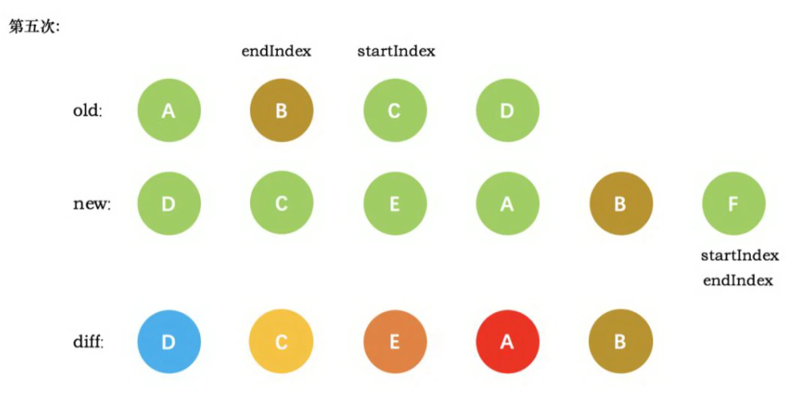

新节点的 `startIndex` 已经大于 `endIndex` 了，需要创建 `newStartIdx` 和 `newEndIdx` 之间的所有节点，也就是节点F，直接创建 F 节点对应的真实节点放到 B 节点后面

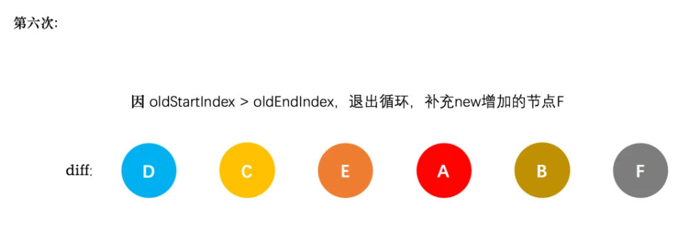

#### 3.3.4 updateChildren函数源代码

```javascript
function updateChildren (parentElm, oldCh, newCh, insertedVnodeQueue, removeOnly) {
    let oldStartIdx = 0 // 旧头索引
    let newStartIdx = 0 // 新头索引
    let oldEndIdx = oldCh.length - 1 // 旧尾索引
    let newEndIdx = newCh.length - 1 // 新尾索引
    let oldStartVnode = oldCh[0] // oldVnode的第一个child
    let oldEndVnode = oldCh[oldEndIdx] // oldVnode的最后一个child
    let newStartVnode = newCh[0] // newVnode的第一个child
    let newEndVnode = newCh[newEndIdx] // newVnode的最后一个child
    let oldKeyToIdx, idxInOld, vnodeToMove, refElm

    // removeOnly is a special flag used only by <transition-group>
    // to ensure removed elements stay in correct relative positions
    // during leaving transitions
    const canMove = !removeOnly

    // 如果oldStartVnode和oldEndVnode重合，并且新的也都重合了，证明diff完了，循环结束
    while (oldStartIdx <= oldEndIdx && newStartIdx <= newEndIdx) {
      // 如果oldVnode的第一个child不存在
      if (isUndef(oldStartVnode)) {
        // oldStart索引右移
        oldStartVnode = oldCh[++oldStartIdx] // Vnode has been moved left

      // 如果oldVnode的最后一个child不存在
      } else if (isUndef(oldEndVnode)) {
        // oldEnd索引左移
        oldEndVnode = oldCh[--oldEndIdx]

      // oldStartVnode和newStartVnode是同一个节点
      } else if (sameVnode(oldStartVnode, newStartVnode)) {
        // patch oldStartVnode和newStartVnode， 索引左移，继续循环
        patchVnode(oldStartVnode, newStartVnode, insertedVnodeQueue)
        oldStartVnode = oldCh[++oldStartIdx]
        newStartVnode = newCh[++newStartIdx]

      // oldEndVnode和newEndVnode是同一个节点
      } else if (sameVnode(oldEndVnode, newEndVnode)) {
        // patch oldEndVnode和newEndVnode，索引右移，继续循环
        patchVnode(oldEndVnode, newEndVnode, insertedVnodeQueue)
        oldEndVnode = oldCh[--oldEndIdx]
        newEndVnode = newCh[--newEndIdx]

      // oldStartVnode和newEndVnode是同一个节点
      } else if (sameVnode(oldStartVnode, newEndVnode)) { // Vnode moved right
        // patch oldStartVnode和newEndVnode
        patchVnode(oldStartVnode, newEndVnode, insertedVnodeQueue)
        // 如果removeOnly是false，则将oldStartVnode.eml移动到oldEndVnode.elm之后
        canMove && nodeOps.insertBefore(parentElm, oldStartVnode.elm, nodeOps.nextSibling(oldEndVnode.elm))
        // oldStart索引右移，newEnd索引左移
        oldStartVnode = oldCh[++oldStartIdx]
        newEndVnode = newCh[--newEndIdx]

      // 如果oldEndVnode和newStartVnode是同一个节点
      } else if (sameVnode(oldEndVnode, newStartVnode)) { // Vnode moved left
        // patch oldEndVnode和newStartVnode
        patchVnode(oldEndVnode, newStartVnode, insertedVnodeQueue)
        // 如果removeOnly是false，则将oldEndVnode.elm移动到oldStartVnode.elm之前
        canMove && nodeOps.insertBefore(parentElm, oldEndVnode.elm, oldStartVnode.elm)
        // oldEnd索引左移，newStart索引右移
        oldEndVnode = oldCh[--oldEndIdx]
        newStartVnode = newCh[++newStartIdx]

      // 如果都不匹配
      } else {
        if (isUndef(oldKeyToIdx)) oldKeyToIdx = createKeyToOldIdx(oldCh, oldStartIdx, oldEndIdx)

        // 尝试在oldChildren中寻找和newStartVnode的具有相同的key的Vnode
        idxInOld = isDef(newStartVnode.key)
          ? oldKeyToIdx[newStartVnode.key]
          : findIdxInOld(newStartVnode, oldCh, oldStartIdx, oldEndIdx)

        // 如果未找到，说明newStartVnode是一个新的节点
        if (isUndef(idxInOld)) { // New element
          // 创建一个新Vnode
          createElm(newStartVnode, insertedVnodeQueue, parentElm, oldStartVnode.elm)

        // 如果找到了和newStartVnodej具有相同的key的Vnode，叫vnodeToMove
        } else {
          vnodeToMove = oldCh[idxInOld]
          /* istanbul ignore if */
          if (process.env.NODE_ENV !== 'production' && !vnodeToMove) {
            warn(
              'It seems there are duplicate keys that is causing an update error. ' +
              'Make sure each v-for item has a unique key.'
            )
          }

          // 比较两个具有相同的key的新节点是否是同一个节点
          //不设key，newCh和oldCh只会进行头尾两端的相互比较，设key后，除了头尾两端的比较外，还会从用key生成的对象oldKeyToIdx中查找匹配的节点，所以为节点设置key可以更高效的利用dom。
          if (sameVnode(vnodeToMove, newStartVnode)) {
            // patch vnodeToMove和newStartVnode
            patchVnode(vnodeToMove, newStartVnode, insertedVnodeQueue)
            // 清除
            oldCh[idxInOld] = undefined
            // 如果removeOnly是false，则将找到的和newStartVnodej具有相同的key的Vnode，叫vnodeToMove.elm
            // 移动到oldStartVnode.elm之前
            canMove && nodeOps.insertBefore(parentElm, vnodeToMove.elm, oldStartVnode.elm)

          // 如果key相同，但是节点不相同，则创建一个新的节点
          } else {
            // same key but different element. treat as new element
            createElm(newStartVnode, insertedVnodeQueue, parentElm, oldStartVnode.elm)
          }
        }

        // 右移
        newStartVnode = newCh[++newStartIdx]
      }
    }
```

# 4.Vue中的虚拟DOM优缺点分析

### 4.1 优点

1. 提高了Vue组件中的渲染性能，组件数据发生变化时不需要重新刷新整个组件对应的DOM
2. Vue的虚拟DOM具有跨平台性，DOM操作进行了封装，可以迁移至安卓或苹果的组件开发

### 4.2 缺点

1. 首次渲染不如不用虚拟DOM，因为虚拟DOM的创建也是耗时操作
2. Vue虚拟DOM设计目的是优化中等细粒度的数据绑定下的DOM更新问题，并没有优化回流重绘。在高性能要求下需要开发者手动操作DOM优化，不过这样破坏了MVVM设计模式提倡的模式。
