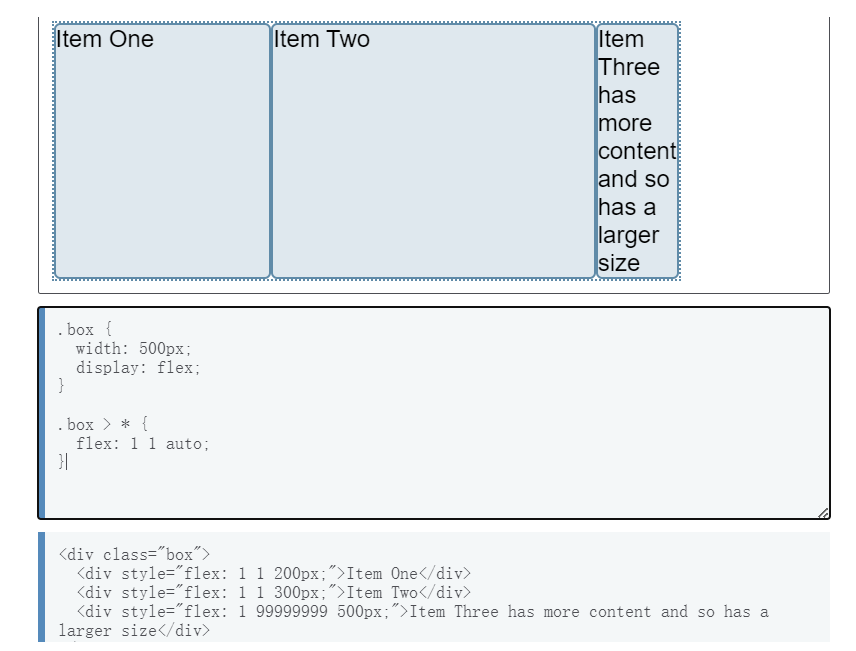

### 1.弹性因子

> **flex-grow：**
>
> > **含义：**
> >
> > 延伸因子
> >
> > **取值：**
> >
> > * 取负值无效。
> > * 取0值表示不延申。
> > * 取小数情况表示不完全延申，W3C不推荐取小数。
>
> **flex-shrink：** 
>
> > **含义：**
> >
> > 收缩因子
> >
> > **取值：**
> >
> > * 取负值无效。
> > * 取0值表示不收缩。
> > * 取小数情况表示不完全收缩，W3C不推荐取小数。
>
> **flex-basis：** 
>
> > **含义：**
> >
> > 元素长度
> >
> > **取值：**
> >
> > * 取0表示项目在容器中不占位置。


### 2.取值语法

#### 2.1 单值语法

> **场景1： 关键字**
>
> > **initial：**
> >
> > ```flex-grow: 0, flex-shrink: 1, flex-basis: auto```
> >
> > **auto：**
> >
> > ```flex-grow: 1, flex-shrink: 1, flex-basis: auto```
> >
> > **none：**
> >
> > ```flex-grow: 0, flex-shrink: 0, flex-basis: auto```
>
> **场景2： 数值**
>
> > ```flex-grow: <number>, flex-shrink: 1, flex-basis: 0```
>
> **场景3： 宽度值**
>
> > ```flex-grow: 0, flex-shrink: 1, flex-basis: 宽度值```

#### 2.2 双值语法

> **第一个值：**
>
> > flex-grow的值
>
> **第二个值：**
>
> > **场景1：数值**
> >
> > ```flex-shrink: <number>; flex-basis: auto;```
> >
> > **场景2：宽度值**
> >
> > ```flex-shrink: 1; flex-basis: 宽度值;```

#### 2.3 三值语法

> flex-grow；flex-shrink；flex-basis


### 3.弹性计算

#### 3.1 基础长度

> **flex-basis取值条件：**
>
> * **auto：** 取元素本身的宽度。
>
> * **宽度值：** 例如px，rem，em，%等。

#### 3.2 延伸计算

> **延伸条件：**
>
> > 布局元素flex-basis值之和小于主轴长度。
>
> **计算方式：**
>
> > **场景1： 布局元素flex-grow之和大于等于1**
> >
> > 全部剩余长度用于延伸，布局元素flex-grow值等比例延伸。
> >
> > **场景2： 布局元素flex-grow之和小于1**
> >
> > 部分剩余长度用于延伸，布局元素flex-grow值等比例延伸。<font color=red>**注：部分长度=剩余长度*Σflex-grow**</font>

#### 3.3 收缩计算

> **收缩条件：**
>
> > 布局元素flex-basis值之和大于主轴长度。
>
> **计算方式：**
>
> > **场景1： 布局元素flex-shrink之和大于等于1**
> >
> > 全部溢出长度用于收缩，布局元素flex-shrink × flex-basis等比例收缩。
> >
> > **场景2： 布局元素flex-shrink之和小于1**
> >
> >  部分溢出长度用于收缩，布局元素flex-shrink × flex-basis等比例收缩。<font color=red>**注：部分长度=溢出长度*Σflex-shrink**</font>


### 4.弹性计算冲突

#### 4.1 有限收缩

> **问题描述：**
>
> 在flex布局元素中，收缩不会太剧烈，避免影响元素中的文本。
>
> **冲突结果：**
>
> 极限状态下的收缩是元素保持 ```width: min-content``` ，并不会完全遵守flex-shrink × flex-basis等比例收缩。
>
> **解决方式：**
>
> 不需要解决。
>
> 

#### 4.2 强制不换行—场景1

> **问题描述：**
>
> 在flex布局元素中，文本不会影响元素布局，但是设置强制换行会导致弹性计算失效。
>
> **冲突结果：**
>
> 超长文本直接溢出，不会根据flex-basis计算。
>
> **解决方式：**
>
> 通常配合 ```overflow: hidden; text-overflow: ellipsis;``` 省略号使用。
>
> 

#### 4.2 强制不换行—场景2

> **问题描述：**
>
> flex布局中元素的宽度是通过flex-basis配合延伸或收缩计算得出，可以不关注元素的width。
>
> 如果flex布局元素中出现了文本溢出隐藏，在不关注布局元素宽度的情况下会导致 ```overflow: hidden``` 计算异常。
>
> **冲突结果：**
>
> 弹性计算异常。
>
> **解决方式：**
>
> 控制文本溢出隐藏的父级节点的宽度。设置 ```width: 0px (任意值)``` 。
>
> 


**参考链接：**

> 博客园博客 https://www.cnblogs.com/oxspirt/p/11070739.html
>
> 掘金博客 https://juejin.cn/post/6904462648520212488#comment
>
> 掘金博客 https://juejin.cn/post/6859547132035072007#comment
>
> W3C官网 https://www.w3.org/TR/2018/CR-css-flexbox-1-20181119/#flex-flex-grow-factor
>
> MDN https://developer.mozilla.org/zh-CN/docs/Web/CSS/CSS_flexible_box_layout/Controlling_ratios_of_flex_items_along_the_main_axis